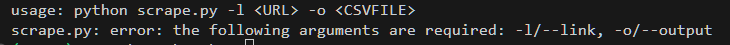
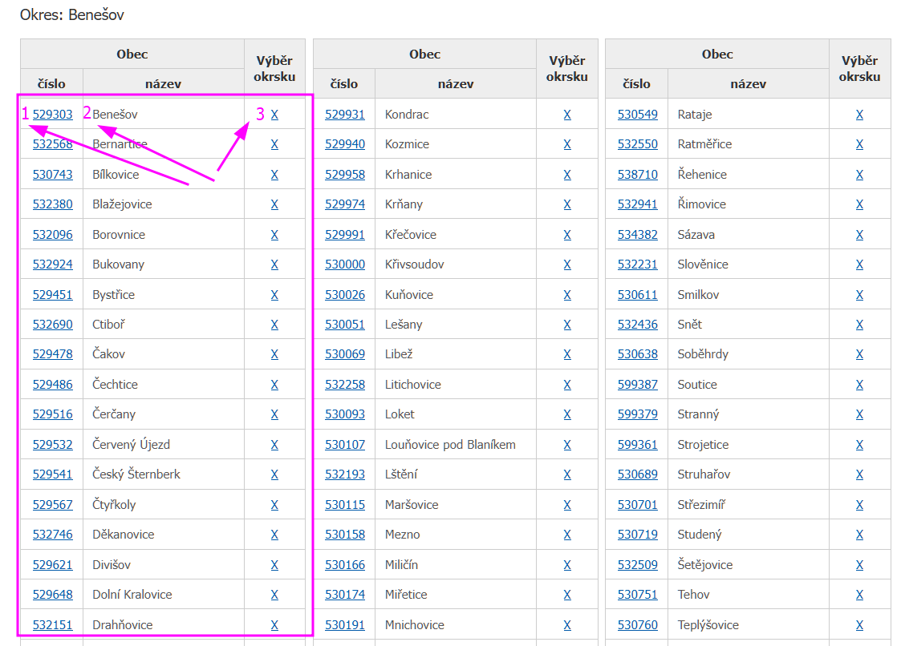
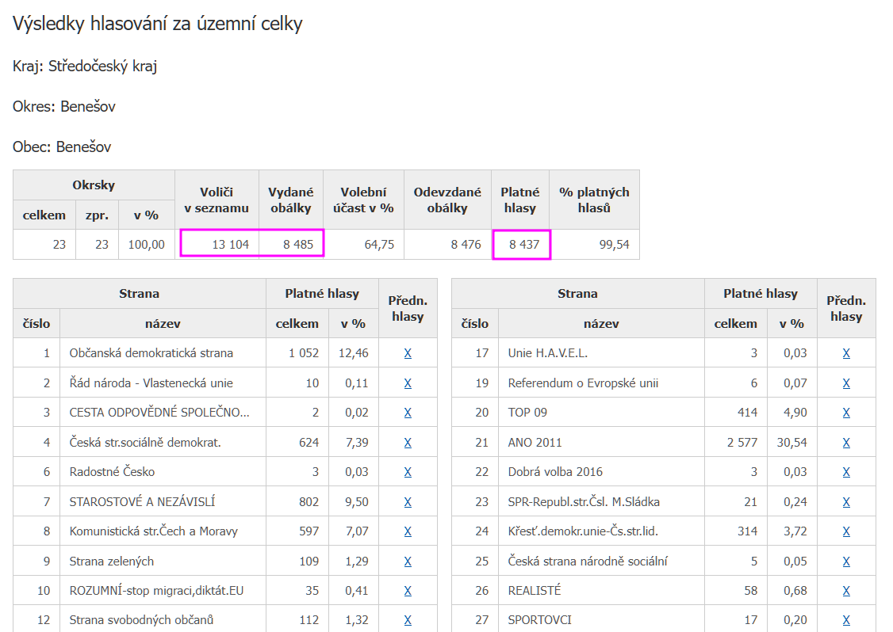
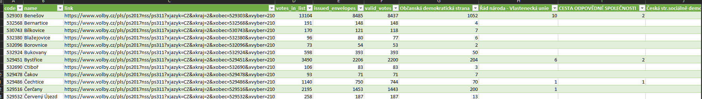

# WebSrape Project

## Requirements
First we have to create virtual environment using following command in command line:
```bash
python -m venv .venv
```

Then activate this environment:
`
 ./.venv/scripts/activate
`

Required libraries are in the `requirements.txt` file and it is necessary to install it using following `pip` command:
```bash
# first update pip to latest version
python -m pip install --upgrade pip

# then install all dependencies
pip install -r requirements.txt
```

---

## Input parameters
- \- l / --link => url address for scraping
- \- o / --output => name of the output file (with .csv extension)
- \--help => help info with usage and program parameters

Run the script:
```bash
python main.py -l "https://www.volby.cz/pls/ps2017nss/ps32?xjazyk=CZ&xkraj=2&xnumnuts=2101" -o test.csv
```

For help:
```
python main.py --help
```


---

## 1. step - Get links
function `get_links`

As first step the script scrape data from first page (url from parameter 1) and get following informations:
1. village code
2. village name
3. link for votes and other elections data

Those informations are scraped for all towns in the particular disctrict and stored in the list of dictionaries.



---

## 2. step - Get votes and other elections data
function `get_votes`

This function expects town dictionary data as input (code, name and link), get this link and scrape additional data (votes, issued_envelopes, valid_votes) for this town.



---

## 3. step - Export to csv
function `export`

This function expects output file name and result data as list of dictionaries save it as csv data with header.



---
